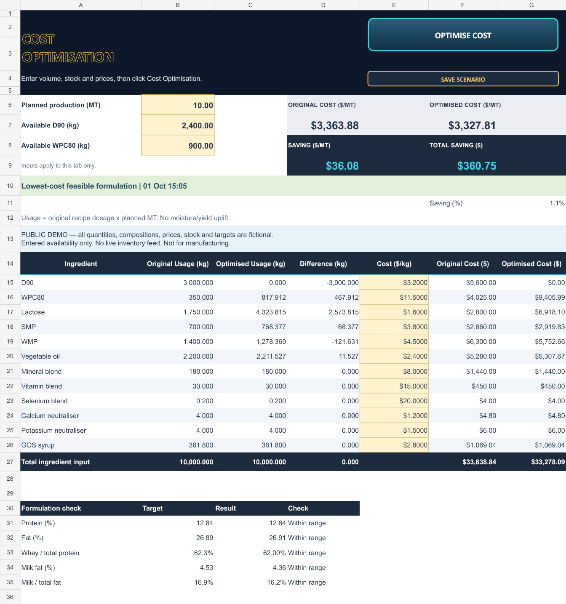

# Formulation Cost Optimisation & Supply Chain Planner

A desktop Excel/VBA planning tool that turns ingredient availability, planned production and prices into an inventory-constrained formulation recommendation.

**Public, fictional-data demo.** All ingredient quantities, compositions, targets, prices and inventory values are illustrative. This is not an approved formulation, manufacturing instruction or commercial specification.

[Download the macro-enabled workbook](Formulation-Supply-Planner-Demo.xlsm) · [View the portfolio showcase](https://charlie-qi394.github.io/charlie-qi-portfolio/#project/formulation-supply-planner)

## Two independent planning workflows

| Workflow | Objective | Inputs |
| --- | --- | --- |
| Supply availability | Find a feasible formulation while minimising weighted changes from the original recipe | Production volume (MT), available D90 and WPC80 (kg), optional other ingredient caps |
| Cost optimisation | Minimise total ingredient cost subject to the same formulation and inventory constraints | Independent production and stock inputs, ingredient prices ($/kg), optional other ingredient caps |

Availability is a hard constraint in both modes. The cost tab does not inherit the supply tab's stock inputs.

The output compares original, optimised and difference quantities in kg for every ingredient. Cost mode shows original and optimised cost, saving per MT and total saving for the planned volume. A constrained plan can cost more than an original recipe that cannot be manufactured with the entered stock; a negative saving is a cost increase, not a promised saving.

## Run the demo

1. Download and inspect the workbook and the VBA source before trusting it. Use desktop Microsoft Excel for Windows, not Excel Online.
2. Enable Excel's Solver Add-in through File → Options → Add-ins → Excel Add-ins → Go → Solver Add-in. Allow macros only if you trust this demo and your organisation's policy permits them; do not disable security globally.
3. Open Supply Plan or Cost Optimisation. Enter production MT and available D90/WPC80 kg. Enter prices in cost mode. Use Other Stock for additional ingredient limits.
4. Click the prominent Calculate or Optimise Cost button. Changed inputs invalidate results until recalculation.
5. Save a named scenario after a successful calculation. Save the workbook to persist those records between sessions.

Zero stock means unavailable. Blank optional Other Stock cells mean no additional stock cap; primary volume/stock inputs must be valid non-negative numbers, with volume greater than zero.

## Compact scenario comparison

Keep up to five snapshots, with the latest selected automatically. Two dropdowns select older records for three-column comparison of ingredient demand, remaining D90/WPC80 and costs. Saving a sixth record asks before replacing the oldest; cancelling preserves the five records. Saved records retain their original inputs and results.

## Calculation approach

Excel Solver's Simplex LP solves six adjustable ingredient quantities: D90, WPC80, lactose, skim milk powder, whole milk powder and vegetable oil. The remaining illustrative ingredients are fixed.

- Ingredient input totals are 1,000 kg per MT; no moisture/yield uplift is added to procurement quantities.
- Linear nutrient mass-balance constraints apply the fictional target bands.
- Whey/total protein and milk/total fat ratio limits are enforced as linear inequalities.
- Ingredient bounds and all entered availability limits remain hard constraints.
- Supply mode minimises weighted absolute recipe deviation; cost mode minimises quantity × price.
- The demo's whey/total protein range is 62.0–63.5%; milk/total fat is 15–18%. These are **fictional demonstration limits**, not production requirements.

The hidden calculation sheets remain in the workbook for inspection by a qualified reviewer. Open the VBA editor with Alt+F11 to inspect modules. Editable source copies are in [source](source); paste WorkbookEvents.txt into ThisWorkbook when rebuilding rather than importing it as a standard module.

[demo-data.json](demo-data.json) documents the fictional fixture. Each row is: ingredient, baseline kg/MT, lower kg/MT, upper kg/MT, $/kg, total solids fraction, lactose, other carbohydrate, casein, whey protein, milk fat, vegetable fat, ash fractions. Other JSON values describe the derived demonstration targets.

## Current capability vs roadmap

**Today:** manually entered availability and prices, immediate recalculation on demand, ingredient-demand forecasting and five saved scenarios. There is no live ERP/WMS connection or stock-movement ledger.

**Potential extension:** timestamped inventory imports or API feeds, receipts/issues/reservations, and reoptimisation when stock changes. Those integrations would require a separate implementation and validation.

## Validation and publication boundary

The demonstration workbook was exercised in native Excel for feasible supply/cost solves, ingredient stock caps, ratio constraints, total ingredient input, five-record retention, latest-scenario refresh, sixth-record confirmation and zero-stock infeasibility. When the original recipe is feasible, the cost test checks that the optimum does not cost more.

This release excludes the private production workbook and its formulation data, supplier identifiers, prices, inventory and scenario history. The public workbook starts with no saved scenarios.

